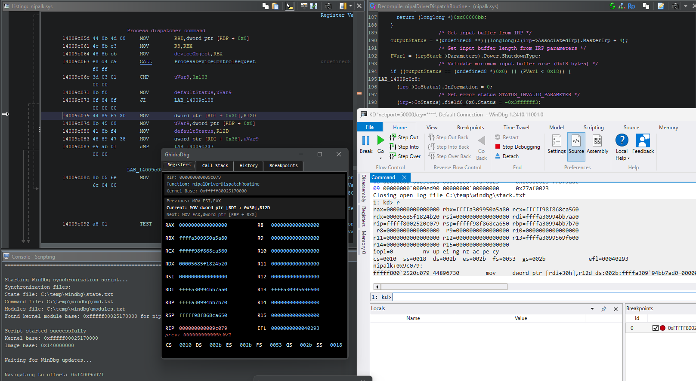
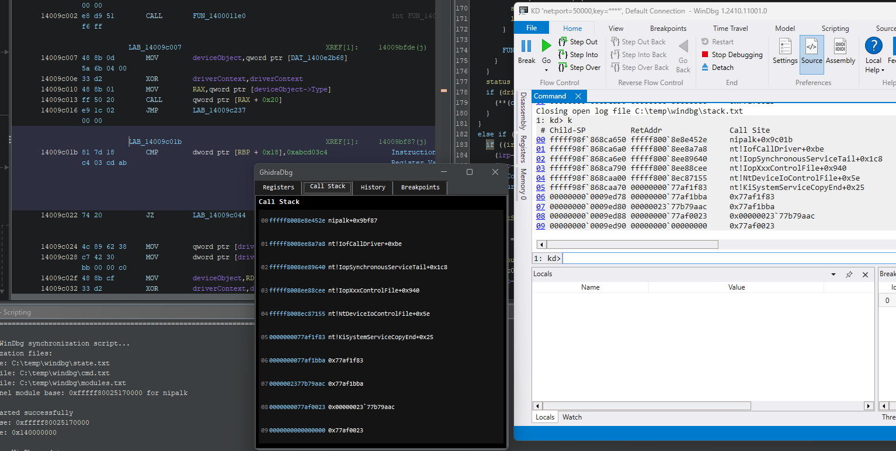

# GhidraDbg

A Python script that creates a bridge between Ghidra and WinDbg for dynamic driver analysis, allowing real-time synchronization of debugging states.

## Screenshots

 

## What do I need?

- Ghidra installed
- WinDbg installed  
- Your driver loaded in both Ghidra and WinDbg
- `C:\temp\windbg` directory (script will create if missing, you should probably change this to a directory of your preference though)

## Setup Instructions

1. **Load Your Driver**
  - Load the driver in Ghidra
  - Load the driver in WinDbg
  - Verify driver is loaded in WinDbg:
    ```
    lm                    # Lists all modules
    !drvobj drivername   # Check specific driver
    ```
    
  - If driver isn't showing, reload modules:
    ```
    .reload              # Regular reload
    .reload /f           # Force reload if needed
    ```

2. **Run the Script**
  - In Ghidra: Window -> Script Manager
  - Load the script into Script Manager 
  - Make sure your driver window is active in Ghidra
  - Run the script

3. **Connect WinDbg**
  - Script will create a GUI window
  - Copy the displayed WinDbg command (looks like `$$>a< C:\temp\windbg\cmd.txt`)
  - Run this command in WinDbg

## Usage

**Basic Operation**
   ```windbg
   # In WinDbg, after EVERY debug command:
   p                                 # Your debug command (step, trace, etc.)
   $$>a< C:\temp\windbg\cmd.txt     # Sync command
   
   t                                 # Another debug command
   $$>a< C:\temp\windbg\cmd.txt     # Sync command again
   
   g                                 # Run until breakpoint
   $$>a< C:\temp\windbg\cmd.txt     # Sync command again
   ```
Again, this is also needed at the start right after you run the script. This is because the script dynamically gets the kernel base address + image base. The filename in Ghidra and the module name in WinDbg is expected to match.

## Troubleshooting

If script fails with `Could not determine kernel base`:
1. Check if driver is loaded in WinDbg (`lm`)
2. Verify driver names match between Ghidra and WinDbg
3. Try reloading modules in WinDbg (`.reload`)
4. Ensure driver window is active in Ghidra

## Common issues

- **Driver not found**: Make sure driver names match exactly between Ghidra and WinDbg (ignoring .sys extension)
- **Script errors**: Ensure your driver window is the active window in Ghidra before running script
- **Sync issues**: Run the sync command after every WinDbg operation

## How It Works

The script creates a bridge between Ghidra and WinDbg using file-based communication through three main files in `C:\temp\windbg`:
- `state.txt`: Contains register values, memory, and execution state
- `cmd.txt`: Contains WinDbg commands to gather debug info  
- `modules.txt`: Contains loaded module information

**When launched, the script:**
1. Creates a command file with WinDbg script commands
2. Gets the kernel base address from modules list
3. Starts a GUI window for displaying state
4. Enters a monitoring loop checking state.txt

**Each time you run the command in WinDbg:**
1. WinDbg executes commands to dump current state in JSON format to state.txt
2. Script detects file changes and parses new state
3. GUI updates with new register values, instruction info, stack trace, etc.
4. Ghidra view synchronizes to current instruction

The script handles address translation between WinDbg kernel addresses and Ghidra program addresses using the kernel base and image base offsets. It analyzes instructions to predict register changes, maintains execution history, and provides visualization through a Java Swing GUI with register states, call stacks, and breakpoint management.

> [!NOTE]  
> Ghidra's scripting system (to my knowledge) does not allow you to directly connect to WinDbg, this is the reason why the script uses file communication.

## Key features
- Real-time register value monitoring
- Instruction analysis and prediction
- Stack trace visualization
- Breakpoint management
- Execution history tracking
- Automatic navigation syncing
